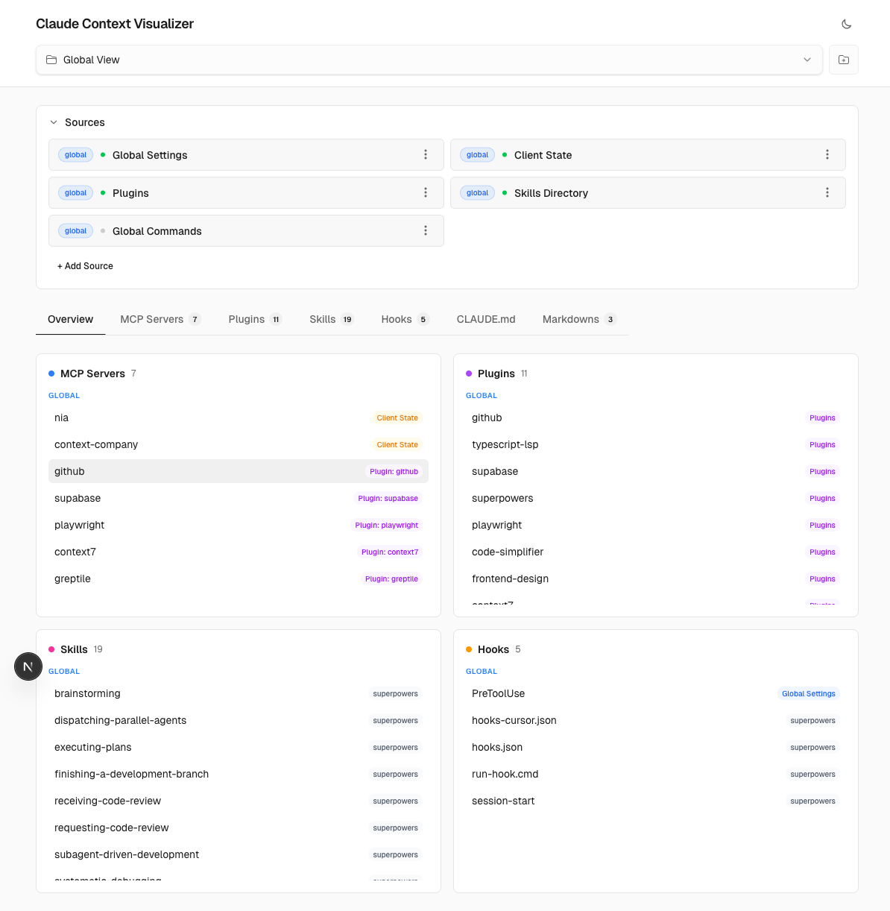

<p align="center">
  
</p>

<h1 align="center">Claude Context Visualizer</h1>

<p align="center">
  <strong>See everything Claude Code sees.</strong><br/>
  Inspect skills, hooks, MCP servers, plugins, commands, and CLAUDE.md across all sources.
</p>

<p align="center">
  <a href="https://www.npmjs.com/package/claude-context-visualizer"></a>
  <a href="https://opensource.org/licenses/MIT"></a>
  <a href="https://nodejs.org/">= 18" /></a>
  <a href="https://www.typescriptlang.org/"></a>
  <a href="https://nextjs.org/"></a>
</p>

<p align="center">
  <a href="#quick-start">Quick Start</a> &bull;
  <a href="#web-dashboard">Dashboard</a> &bull;
  <a href="#cli">CLI</a> &bull;
  <a href="#what-it-scans">What It Scans</a> &bull;
  <a href="#api-reference">API</a> &bull;
  <a href="#contributing">Contributing</a>
</p>

---

## Why?

Claude Code reads configuration from **14+ locations** — global settings, project configs, plugins, skills directories, MCP server configs, CLAUDE.md with recursive `@include` directives, and more. When something isn't working, the first question is always: *"what does Claude actually see?"*

This tool answers that question. Point it at any project and get a complete picture of every skill, hook, MCP server, plugin, command, and markdown file that Claude Code will load.

---

## Quick Start

```bash
# Start the web dashboard
npx claude-context-visualizer

# Or use the shorter alias
npx ccv
```

Opens a local dashboard at **http://localhost:3000** showing your full Claude Code configuration context.

### Install globally (recommended)

```bash
npm install -g claude-context-visualizer
```

This also installs a **Claude Code skill** to `~/.claude/skills/context-visualizer/` — so Claude itself can scan and report on its own configuration when you ask it to.

### Install locally in a project

```bash
npm install claude-context-visualizer
```

Installs the skill to `.claude/skills/context-visualizer/` in your project.

---

## Web Dashboard

The dashboard provides a tabbed interface for exploring everything Claude Code sees:

| Tab | What it shows |
|-----|---------------|
| **Overview** | At-a-glance counts, source status, agents |
| **Skills** | All skills grouped by source (plugins, global, project, built-in) |
| **Hooks** | Event hooks with commands, matchers, and resolved script paths |
| **MCP Servers** | Configured servers with live introspection (tools, resources, prompts) |
| **Plugins** | Installed plugins and all their sub-resources |
| **Markdowns** | Every `.md` file Claude Code discovers |
| **CLAUDE.md** | Fully resolved content with `@include` directives expanded |

**Features:**
- **Project selector** — switch between projects, supports [Conductor](https://conductor.dev) worktrees
- **Live MCP introspection** — connect to running servers and discover their tools, resources, and prompts
- **Inline markdown editor** — edit skills and docs directly with Tiptap
- **Detail panel** — click any item to inspect it in a slide-out panel
- **Dark mode**
- **Custom port** — `npx ccv --port 4000`

---

## CLI

The CLI outputs JSON, making it composable with `jq` and other tools.

### Scan a project

```bash
# Full context (everything)
npx ccv scan /path/to/project

# Scan current directory with pretty-printing
npx ccv scan . --pretty
```

### Query specific sections

```bash
npx ccv scan /path -s skills        # All skills (name, source, scope, size, tokens)
npx ccv scan /path -s hooks         # All hooks (event, command, matcher, source)
npx ccv scan /path -s mcpServers    # MCP servers (type, config, source)
npx ccv scan /path -s plugins       # Plugins with sub-resources
npx ccv scan /path -s commands      # Commands with YAML frontmatter metadata
npx ccv scan /path -s sources       # All config source paths + found status
npx ccv scan /path -s claudeMd      # Resolved CLAUDE.md with @includes expanded
npx ccv scan /path -s markdowns     # All discovered .md files
npx ccv scan /path -s summary       # Quick counts of everything
```

### Discover projects

```bash
# Projects from ~/.claude.json
npx ccv scan --list-projects

# Conductor repos, worktrees, and resolved main repo paths
npx ccv scan --conductor-projects --pretty
```

### Read files

```bash
npx ccv scan --read-file /path/to/file --pretty
```

JSON files get secret masking — keys matching `token`, `key`, `secret`, `password`, `auth` are automatically truncated.

### MCP introspection

```bash
# List all configured MCP servers
npx ccv scan --introspect -p /path

# Introspect all servers (connect and query tools/resources/prompts)
npx ccv scan --introspect --all -p /path --pretty

# Introspect a specific server
npx ccv scan --introspect --server nia -p /path --pretty
```

### Hook enrichment

```bash
# Dump all hooks with source code as JSON (for agent-assisted analysis)
npx ccv scan --dump-hooks -p /path

# Write enrichment data from stdin
npx ccv scan --write-enrichments < enrichments.json
```

### Composable examples

```bash
# Compare skill counts across all Conductor worktrees
npx ccv scan --conductor-projects | jq -r '.projects[].worktrees[].path' | \
  while read wt; do
    echo "$(basename $wt): $(npx ccv scan "$wt" -s summary 2>/dev/null | jq '.skills')"
  done

# Find all unique MCP servers across projects
npx ccv scan --conductor-projects | jq -r '.projects[].worktrees[].path' | \
  while read wt; do
    npx ccv scan "$wt" -s mcpServers 2>/dev/null | jq -r '.[].name'
  done | sort -u

# Diff hooks between two projects
diff <(npx ccv scan /path/a -s hooks | jq -r '.[].command' | sort) \
     <(npx ccv scan /path/b -s hooks | jq -r '.[].command' | sort)

# Get the full resolved CLAUDE.md
npx ccv scan . -s claudeMd | jq -r '.'
```

---

## What It Scans

### Config sources (14+ locations)

| Source | Scope | Path |
|--------|-------|------|
| Global Settings | global | `~/.claude/settings.json` |
| Client State | global | `~/.claude.json` |
| Plugins | global | `~/.claude/plugins/installed_plugins.json` |
| Skills Directory | global | `~/.claude/skills/` |
| Agents Skills | global | `~/.agents/skills/` |
| Global Commands | global | `~/.claude/commands/` |
| Project Settings | local | `<project>/.claude/settings.local.json` |
| CLAUDE.md | local | `<project>/CLAUDE.md` |
| MCP Config | local | `<project>/.mcp.json` |
| Project Skills | local | `<project>/.claude/skills/` |
| Project Agents Skills | local | `<project>/.agents/skills/` |
| Project Commands | local | `<project>/.claude/commands/` |
| Shared Settings | local | `<project>/.claude/settings.json` |
| User Project CLAUDE.md | local | `~/.claude/projects/<slug>/CLAUDE.md` |
| Auto Memory | local | `~/.claude/projects/<slug>/memory/` |

### Extracted data

| Category | Details |
|----------|---------|
| **MCP Servers** | Name, scope, source, type (stdio/http/sse), config. Live introspection returns tools (with inputSchema), resources, prompts. |
| **Plugins** | Name, version, install path, marketplace info, and lists of skills, hooks, agents, commands, MCP servers. |
| **Skills** | From 7 sources: plugin skills, global skills, global agents skills, project skills, project agents skills, commands-as-skills, built-in skills (extracted from Claude binary). Each has name, description, scope, source, file path, size, lines, tokens. |
| **Hooks** | Events: PreToolUse, PostToolUse, UserPromptSubmit, SessionStart, SessionEnd, SubagentStart, SubagentStop. Each has event, command, matcher, scope, source, resolved script path. |
| **Commands** | From `~/.claude/commands/` and project command dirs, with YAML frontmatter metadata. |
| **CLAUDE.md** | Fully resolved with `@include` directives expanded recursively (5 levels deep). |
| **Markdowns** | All `.md` files from `~/.claude/`, project root, `.claude/`, `docs/`, `.skills/`, auto-memory. |

---

## API Reference

When running the web server, these endpoints are available:

| Method | Endpoint | Purpose |
|--------|----------|---------|
| `GET` | `/api/projects` | All projects, Conductor repos/worktrees |
| `GET` | `/api/context?project=<path>` | Full context scan |
| `GET` | `/api/file?path=<path>` | Read any file (JSON secrets masked) |
| `POST` | `/api/file` | Write `.md` files |
| `POST` | `/api/mcp-introspect` | Live MCP server introspection |
| `POST` | `/api/browse` | macOS folder picker |

---

## Development

```bash
git clone https://github.com/kbhuw/claude-context-visualizer.git
cd claude-context-visualizer
bun install
bun run dev          # Dev server at http://localhost:3000
bun run build        # Production build
bun run lint         # ESLint
bun run scan <path>  # CLI scanner
```

### Tech stack

- **Framework**: [Next.js 16](https://nextjs.org/) (App Router), [React 19](https://react.dev/), [TypeScript 5](https://www.typescriptlang.org/)
- **Styling**: [Tailwind CSS v4](https://tailwindcss.com/), [Radix UI](https://www.radix-ui.com/), [shadcn/ui](https://ui.shadcn.com/)
- **Editor**: [Tiptap](https://tiptap.dev/) (rich text markdown editing)
- **MCP**: [@modelcontextprotocol/sdk](https://github.com/modelcontextprotocol/typescript-sdk) for server introspection
- **Runtime**: [Bun](https://bun.sh/) (development), Node.js 18+ (npm distribution)

### Project structure

```
src/
├── app/                 # Next.js App Router pages
│   └── api/             # Backend endpoints
├── components/          # React UI (tab views, detail panels, editors)
│   └── ui/              # shadcn/ui primitives
├── lib/
│   ├── scanner.ts       # Core scanning logic (the heart of the app)
│   └── types.ts         # Shared TypeScript interfaces
└── cli/                 # CLI entry points

bin/ccv.js               # npm bin entry point
scripts/postinstall.js   # Skill installer (global or local)
skill/SKILL.md           # Claude Code skill (installed on npm install)
```

---

## Contributing

Contributions are welcome! Please open an issue first to discuss what you'd like to change.

```bash
# Fork & clone
git clone https://github.com/<your-username>/claude-context-visualizer.git
cd claude-context-visualizer
bun install
bun run dev
```

---

## License

[MIT](LICENSE) &copy; Kush Bhuwalka
